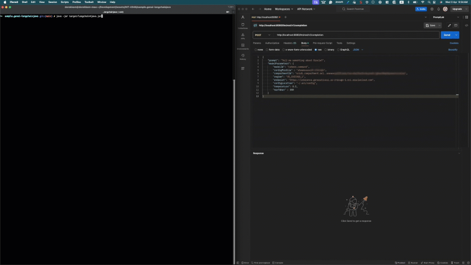

# Oracle Cloud Infrastructure Generative AI with LangChain For Java

## Introduction

LangChain is a powerful, user-friendly tool that empowers developers to harness the potential of artificial intelligence.  While many developers have traditionally turned to Python for their AI projects, we understand that there are instances where Java is your programming language of choice. That's where LangChain Java Framework steps in to bridge the gap.  So, whether you're a seasoned Java developer looking to integrate AI capabilities into your projects or a newcomer eager to explore the world of AI, this sample code demonstrate how to use LangChain Java Open Source framework to simplifies the process and offers a seamless experience with Oracle Cloud Infrastructure Generative AI service.

## What is LangChain?

LangChain Java Framework simplifies the integration of AI capabilities into your Java applications, making it the go-to choice for both seasoned Java developers and newcomers eager to explore the AI landscape. In this repository, we'll provide you with a sample code that demonstrates how to utilize the LangChain Java Open Source framework to streamline the process and seamlessly leverage Oracle's Generative AI service.

## Getting Started

This code sample enhances the functionality of the LangChain Java Framework by incorporating several extensions tailored for common use cases:

1. Large Language Model - Enables users to interact with the Oracle Gen AI large language model using OCI Generative AI Java SDK.  It supports Generation, Embed, and Summarization using Cohere models. The sample code can also be extended to support LLMA 2 model.

2. HTTP Request Chain - This chain allows users to make REST API calls by providing the API's URL and credentials. Presently, it only supports basic authentication.

3. SQL Chain for Oracle Database - Offers support for Oracle Database operations. This chain facilitates two query modes: model-generated SQL statements and user-supplied SQL statements. Refer to the unit test cases in the test folder for examples.

The Helidon MP application serves as a demonstration of how to leverage this framework to create APIs for your application.



## Prerequisite

- OCI CLI was installed and configured on a local machine.
- Clone this repository
- Install JDK 21 on a local machine. (Note: This is the minimum requirement for Helidon 4.x, see [Helidon v4 documentation](https://helidon.io/docs/v4/mp/guides/config) for details)
- Follow the OCI environment configuration instruction in [Oracle Cloud Infrastructure SDK for Java Configuration](https://docs.oracle.com/en-us/iaas/Content/API/Concepts/sdkconfig.htm#:~:text=Oracle%20Cloud%20Infrastructure%20SDK%20for%20Java%20Configuration) to setup the config file.

## Oracle Cloud Infrastructure Service

This demo requires the folloing Oracle Cloud Infrastructure Service:

- [Oracle Cloud Infrastructure Generative AI Service](https://www.oracle.com/au/artificial-intelligence/generative-ai/)

## Build and Run

- Before you run the build and test, edit the following files and provide your Generative AI environment details and the URL and credential of the API and database in your environment. By default, the test will skip all HTTP request and database chain tests.
  - src/test/java/com/oracle/ateam/genai/langchain4java/TestGenAILangChain4Java.java
  - src/test/resources/llm.json
  - src/test/resources/http_request_chain.json
  
- Run the following command to build the source code and perform the unit tests.

  With JDK21

    ```bash
    mvn clean package -DskipTests
    java -jar target/langchain4java.jar
    ```

- To run the API Helidon MP Application, run the following command:
  
  ```bash
    java -jar target/langchain4java.jar
  ```

## Exercise the application

- Get default app version:

  ```bash
    curl -X GET http://localhost:8080/llm/rest/v1
  ```

- Run Completion:

  ```bash
    curl -d "@src/test/resources/llm.json" -H "Content-Type: application/json" -X POST http://localhost:8080/llm/rest/v1/completion
  ```

- Run Chain (chainType = llm, httpRequest or oracleDb):

  ```bash
  curl -d -d "@src/test/resources/http_request_chain.json" -H "Content-Type: application/json" -X POST http://localhost:8080/llm/rest/v1/chain/httpRequest
  ```

## Building a Native Image

The generation of native binaries requires an installation of GraalVM 22.1.0+.

You can build a native binary using Maven as follows:

```bash
mvn -Pnative-image install -DskipTests
```

The generation of the executable binary may take a few minutes to complete depending on
your hardware and operating system. When completed, the executable file will be available
under the `target` directory and be named after the artifact ID you have chosen during the
project generation phase.

## Building the Docker Image

Before you build the docker image, create a config folder and copy your OCI configuration file and private key to the project folder.

```bash
mkdir config
cp ~/.oci/* config
```

Run the following docker build command to build the docker image

```bash
docker build -t langchain4java .
```

## Running the Docker Image

```bash
docker run --rm -p 8080:8080 langchain4java:latest
```

Exercise the application as described above.

## Run the application in Kubernetes

If you don’t have access to a Kubernetes cluster, you can [install one](https://helidon.io/docs/latest/#/about/kubernetes) on your desktop.

## Verify connectivity to cluster

```bash
kubectl cluster-info                        # Verify which cluster
kubectl get pods                            # Verify connectivity to cluster
```

## Deploy the application to Kubernetes

```bash
kubectl create -f app.yaml                  # Deploy application
kubectl get pods                            # Wait for quickstart pod to be RUNNING
kubectl get service  langchain4java         # Get service info
```

Note the PORTs. You can now exercise the application as you did before but use the second
port number (the NodePort) instead of 8080.

After you’re done, cleanup.

```bash
kubectl delete -f app.yaml
```

## Building a Custom Runtime Image

Build the custom runtime image using the jlink image profile:

```bash
mvn package -Pjlink-image
```

This uses the helidon-maven-plugin to perform the custom image generation.
After the build completes it will report some statistics about the build including the reduction in image size.

The target/langchain4java-jri directory is a self contained custom image of your application. It contains your application,
its runtime dependencies and the JDK modules it depends on. You can start your application using the provide start script:

```bash
./target/langchain4java-jri/bin/start
```

Class Data Sharing (CDS) Archive
Also included in the custom image is a Class Data Sharing (CDS) archive that improves your application’s startup
performance and in-memory footprint. You can learn more about Class Data Sharing in the JDK documentation.

The CDS archive increases your image size to get these performance optimizations. It can be of significant size (tens of MB).
The size of the CDS archive is reported at the end of the build output.

If you’d rather have a smaller image size (with a slightly increased startup time) you can skip the creation of the CDS
archive by executing your build like this:

```bash
mvn package -Pjlink-image -Djlink.image.addClassDataSharingArchive=false
```

For more information on available configuration options see the helidon-maven-plugin documentation.

## Contributing

This project welcomes contributions from the community. Before submitting a pull request, please [review our contribution guide](./CONTRIBUTING.md)

## Security

Please consult the [security guide](./SECURITY.md) for our responsible security vulnerability disclosure process.

## Distribution

Developers choosing to distribute a binary implementation of this project are responsible for obtaining and providing all required licenses and copyright notices for the third-party code used in order to ensure compliance with their respective open source licenses.

## Help

Visit Oracle Cloud Customer Connect Community at [Cloud Customer Connect](https://cloudcustomerconnect.oracle.com) for additional resources and FAQs.

## License

Copyright (c) 2023, 2024 Oracle and / or its affiliates.

Released under the Universal Permissive License v1.0 as shown at
<https://oss.oracle.com/licenses/upl/>.
